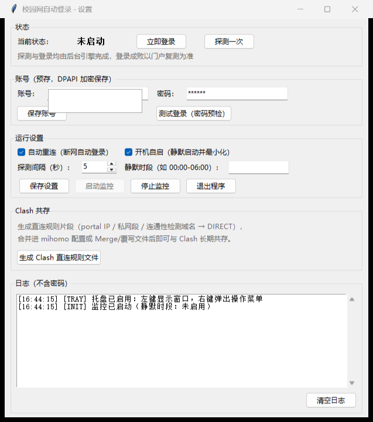

# ZUA 校园网自动登录 · zua-campus-auto-login


> 郑州航空工业管理学院（**ZUA**）校园网自动登录工具：开机自动认证、断线自动重连、Clash 长期共存。以**桌面小插件**形式停靠屏幕右下角，账号密码本地加密，全部操作开关化。
>
> **标注：`zua`** ｜ 协议：`webauth.do` 实名认证（普通表单 POST）｜ 平台：Windows 10/11

## 功能特性

- **开机自动认证**：联网探测发现未认证即自动提交登录，无需手动打开认证页
- **断线自动重连**：指数退避重试（1s 起、封顶 60s），登录结果以"重新探测"裁决，超时/丢包安全重试不重复提交
- **Clash 共存**：三层直连防线，Clash 开着也能认证；支持一键生成直连规则片段（详见 [docs/clash.md](docs/clash.md)）
- **小插件界面**：启动后自动停靠**屏幕右下角**，紧凑尺寸（约 420×580），内容区可滚动、窗口可自由缩放，不抢工作区
- **静默时段防误触**：框内滑动选时间，**点「设定」才生效**——日常误滑不会改动静默时间
- **账号本地加密**：DPAPI（当前 Windows 用户）加密保存，不明文落盘、不进日志、不进仓库
- **轻量**：单文件便携 exe（约 12MB）；源码模式零第三方依赖（纯标准库 + tkinter）

## 快速开始

### 方式一：单文件便携版（推荐）

1. 获取 `CampusAutoLogin.exe`（[Releases](https://github.com/Jump-Zero/zua-campus-auto-login/releases) 附件，或本地构建 `dist/CampusAutoLogin.exe`）
2. 双击运行 → 填写账号密码 → **保存账号** → **测试登录**（验证密码正确）
3. 勾选**自动重连**与**开机自启** → **保存设置** → **启动监控**
4. Clash 用户：点**生成 Clash 直连规则文件**，按 [docs/clash.md](docs/clash.md) 合并进配置（仅系统代理模式可跳过）

> 便携使用：把 `exe` 与同目录的 `config.json`、`credential.bin` 一起拷贝即可（凭据仅限同一 Windows 用户解密）。

### 方式二：源码运行

```powershell
# 图形界面（需 Python 3.11+，tkinter）
py gui.py

# 纯命令行（零依赖，任何 Python 3.8+）
python campus_login.py --set-account   # 保存账号（仅首次）
python campus_login.py                 # 常驻监控
```

## 界面说明（小插件）

> 启动后自动停靠屏幕右下角；内容超出窗口高度时可滚动查看，窗口可任意缩放（最小 380×420）。



| 区域 | 说明 |
|---|---|
| 状态 | 实时状态（在线/未认证/重连中），立即登录、探测一次 |
| 账号 | 预存账号密码（DPAPI 加密），保存账号、测试登录（密码预检） |
| 运行设置 | 自动重连、开机自启、探测间隔、保存设置、启停监控 |
| 静默时段 | 滑动选时间区间 + 「设定」确认（见下节） |
| Clash 共存 | 一键生成直连规则文件 |
| 日志 | 运行记录（不含密码），支持清空 |

托盘：左键/双击显示窗口；右键菜单（显示窗口/立即登录/启动监控/停止监控/退出）；点窗口 ✕ 只是收进托盘，彻底退出走托盘菜单或「退出程序」。

## 静默时段：滑动选时间 + 「设定」确认

针对"夜间断网时段不需要反复登录"的场景（也回答了为什么不能随手滑改）：

1. 勾选**启用**，在「开始 / 结束」两个时间框里**按住上下滑动**（或用鼠标滚轮）选择时间，如 `23:00 - 07:00`，支持跨午夜
2. **滑动只是暂存**：界面会显示「生效：xx ｜ 待设定：yy」，只有点**「设定」**后才真正生效并保存
3. 点**「还原」**可撤销未设定的滑动改动
4. 监控运行中点「设定」**即时生效**，无需重启监控

> 为什么这样设计：时间框支持滑动操作，但日常拖动窗口/滚动时容易误触改动静默时间，因此加了「设定」确认这一步。

## Clash 共存说明

详细版见 **[docs/clash.md](docs/clash.md)**。核心结论：

| Clash 模式 | 不配规则能否自动登录 | 原因 |
|---|---|---|
| 仅系统代理（不开 TUN） | ✅ 可以 | 工具的探测/登录请求强制直连，绕开 Clash |
| TUN 模式 | ❌ 需配规则 | 流量在 IP 层被 TUN 接管，认证服务器需 DIRECT + 路由排除 |

最小规则（TUN 模式）：

```yaml
rules:
  - IP-CIDR,202.196.169.166/32,DIRECT,no-resolve
  - IP-CIDR,10.0.0.0/8,DIRECT,no-resolve
tun:
  route-exclude-address: [202.196.169.166/32, 10.0.0.0/8]
```

规则必须放在 `MATCH` 兜底规则**之前**；推荐用客户端的 Merge/覆写功能合并，订阅更新不会冲掉。

## 命令行参考（campus_login.py）

| 命令 | 作用 |
|---|---|
| `--check` | 探测一次网络状态（ONLINE / UNAUTH / OFFLINE） |
| `--show-form` | 只读抓取登录页并打印表单字段（协议确认用） |
| `--login-once` | 手动触发一次登录后退出 |
| `--test-account` | 密码预检（check=0 正确 / 2 账号不存在 / 3 密码错误） |
| `--set-account` | 保存账号密码（DPAPI 加密） |
| `--selftest` | 状态机干跑自检（无需网络与账号） |
| `--login-url <URL>` | 指定登录页完整 URL（含 wlanacip 等参数） |

图形界面另支持 `py gui.py --selfcheck`（界面自检）与 `py gui.py --diag`（自诊断，输出 `diag.txt`）。

## 配置文件 config.json

| 字段 | 默认值 | 说明 |
|---|---|---|
| `portal_base` | `http://202.196.169.166` | 认证服务器地址 |
| `detect_url` | `http://www.msftconnecttest.com/redirect` | 连通性探测地址（302 到门户即未认证） |
| `probe_interval_sec` | `5` | 在线检测间隔（秒） |
| `backoff_base_sec` / `backoff_max_sec` | `1` / `60` | 重试退避基数与上限 |
| `request_timeout_sec` | `10` | 单次请求超时 |
| `quiet_hours` | `""` | 静默时段区间 `"HH:MM-HH:MM"`（界面滑选后点「设定」写入；留空不启用） |

## 项目结构

```
campus-auto-login/
├── campus_login.py        # 核心引擎：探测 / 表单登录 / 断线重连 / 状态机
├── gui.py                 # 小插件界面（tkinter）：滑选时间、设定确认、日志
├── tray_icon.py           # 系统托盘（pywin32，缺失时自动降级纯窗口）
├── config.example.json    # 配置模板
├── assets/tray.ico        # 托盘/程序图标
├── docs/clash.md          # Clash 共存详细说明
├── docs/research-report/  # 调研与方案报告（含 GitHub 项目对比、协议分析）
├── docs/img/gui-main.png  # 界面截图
└── .github/workflows/     # CI：自检 → 构建 → 发布
```

## 开发与构建

```powershell
# 自检
python campus_login.py --selftest      # 引擎状态机不变量断言（6 组用例）
py gui.py --selfcheck                  # 界面构建自检
py gui.py --diag                       # 运行环境自诊断

# 构建单文件 exe（图标随包）
py -m PyInstaller --noconfirm --onefile --noconsole --name CampusAutoLogin `
  --icon assets\tray.ico --add-data "assets\tray.ico;assets" gui.py
```

**CI 自动化**（`.github/workflows/build.yml`）：推送 `main` 自动自检并构建（产物在 Actions 的 Artifacts）；推送 `v*` 标签自动发布 Release 并上传 exe + 构建清单。构建产物清单见 `dist/build_info.json`（SHA256、工具链、源码哈希，支持等价重建回滚）。

## 常见问题

| 问题 / 疑问 | 解答 |
|---|---|
| 为什么静默时间改了不生效？ | 滑动只是暂存，需点**「设定」**确认，防止日常误触改动 |
| 滑动选时间时页面会不会跟着滚？ | 不会。时间框/日志的滚轮与拖动已与整页滚动隔离 |
| 窗口太小看不全设置？ | 内容区可滚动；也可自由拉伸窗口（最小 380×420） |
| 为什么窗口出现在右下角？ | 小插件设计，启动自动停靠屏幕右下角、避开任务栏 |
| 未配置账号就开机自启会弹窗吗？ | 不弹模态框，仅在日志区提示"请先保存账号" |
| Clash 开着无法认证？ | 系统代理模式无需配置；TUN 模式按 [docs/clash.md](docs/clash.md) 配最小规则 |
| 规则加了没生效？ | 检查是否在 `MATCH` 兜底规则**之前**，并重载配置 |
| 改了密码 | 界面改密码 → 保存账号 → 测试登录 |
| 换校区 / 网关参数变化 | 无需改动，`wlanuserip/mac/wlanacname` 等参数每次联网实时解析 |
| 密码安全吗 | 仅 DPAPI 密文存本机 `credential.bin`，不进日志/仓库；换机器无法解密 |

## 安全说明

- 账号密码仅以 **DPAPI（CurrentUser）密文** 保存，`.gitignore` 强制排除，绝不提交
- 日志与界面对密码/字段值脱敏；README 截图为空账号版
- 登录请求全程强制直连；密码提交为门户协议本身的明文表单（HTTP），属校园网认证系统限制
- 请仅使用**本人账号**，遵守学校网络管理规定

## 免责声明

本工具仅供学习与个人便捷使用，请遵守郑州航空工业管理学院校园网管理规定；使用风险自负。

## License

[MIT](LICENSE) · **标注：`zua`**
